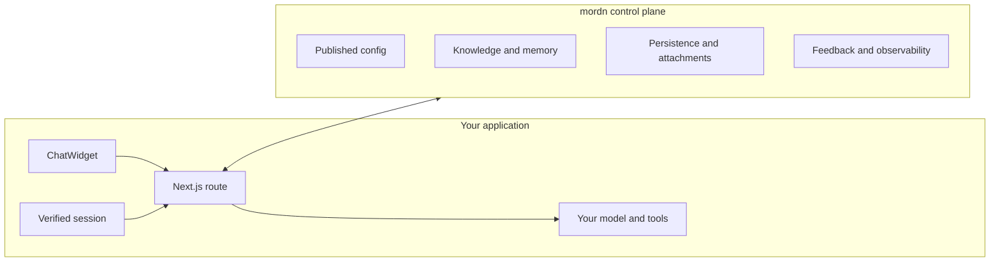
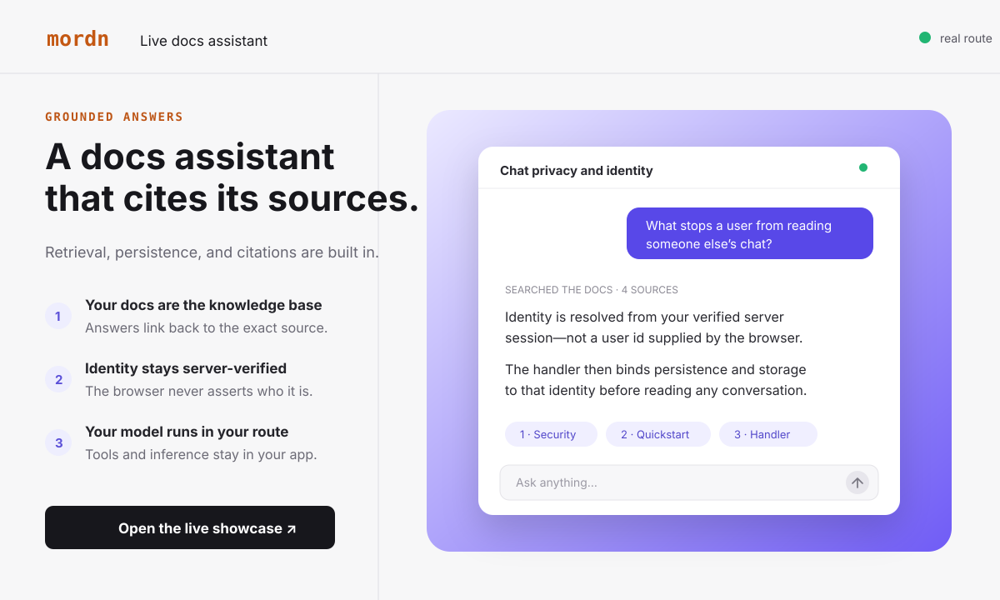

# @mordn/chat-widget

**The open-source AI chat layer for Next.js: your model and tools run on your server while mordn hosts the production infrastructure around them.**

[](https://www.npmjs.com/package/@mordn/chat-widget)
[](https://www.npmjs.com/package/@mordn/chat-widget)
[](./LICENSE)

[Start building](https://mordn.com/sign-up) · [Quickstart](https://mordn.com/docs/quickstart) · [Live showcase](https://mordn.com/showcase) · [Documentation](https://mordn.com/docs)

## The split



The browser never asserts a user id, model, prompt, or agent configuration. Your route resolves identity from a verified server session and runs inference and tool calls in your deployment. mordn supplies the published configuration and the operational plumbing around each conversation.

## See it working

[](https://mordn.com/showcase)

The [live showcase](https://mordn.com/showcase) runs real docs, ecommerce, and travel assistants against real server routes—not canned recordings.

## Hosted quickstart

Add a production chat agent to a Next.js App Router application. No database, object store, migration, or model-provider package is required.

### 1. Create and publish an agent

[Create an account](https://mordn.com/sign-up), publish an agent, and copy its server key.

```env
MORDN_CHAT_KEY="mck_live_..."
```

### 2. Install

```bash
npm install @mordn/chat-widget ai @ai-sdk/react
```

### 3. Add one server route

```ts
// app/api/chat/[[...chat]]/route.ts
import { createMordnHandler } from '@mordn/chat-widget/server';
import { auth } from '@clerk/nextjs/server';

export const { GET, POST, DELETE, OPTIONS } = createMordnHandler({
  apiKey: process.env.MORDN_CHAT_KEY!,
  getUserId: async () => (await auth()).userId,
});
```

Use the authentication system you already trust—Clerk, Auth.js, Supabase Auth, or your own sessions. `getUserId` must return a stable id from a **verified server session**, or `null`.

> `getUserId` is the authorization boundary. Never derive it from a header, query parameter, or request body controlled by the browser. See the [security model](https://mordn.com/docs/security).

### 4. Mount the widget

```tsx
'use client';

import { ChatWidget } from '@mordn/chat-widget';
import '@mordn/chat-widget/styles.css';

export function Assistant() {
  return <ChatWidget />;
}
```

Render `<Assistant />`, sign in, and send a message. The published agent config supplies the model, system prompt, theme, knowledge, memory, and enabled features. Conversations and attachments persist automatically.

Follow the [complete quickstart](https://mordn.com/docs/quickstart) for Auth.js examples, deployment notes, and a production verification checklist.

## Why mordn

### Your model and tools stay on your server

Inference and tool execution happen inside your Next.js route on your gateway or provider credentials. mordn does not proxy the model call or bill you for tokens. Pin models and register tools in code whenever the host application needs control.

### User identity is server-verified

The widget sends no client-controlled `userId`. The handler binds stores and storage to the identity returned by your verified session, making cross-user conversation access unrepresentable through the public contracts.

### Production infrastructure without rebuilding the plumbing

Published configuration, conversation history, private attachments, knowledge retrieval, memory, feedback, and observability are wired through one server key. You keep the application-specific runtime; mordn operates the reusable control plane.

## Prefer to manage the data plane yourself?

Use `createChatHandler` with the included Drizzle, Supabase, or custom `ChatStore` and `StorageAdapter` implementations. The widget and server-side identity boundary stay the same; you supply the model, database, storage, prompt, and tools.

[Bring your own database](https://mordn.com/docs/quickstart/self-host) · [Backend guide](https://mordn.com/docs/backends/overview)

## Documentation

| Build | Operate | Reference |
| --- | --- | --- |
| [Quickstart](https://mordn.com/docs/quickstart) | [Production readiness](https://mordn.com/docs/guides/production-readiness) | [ChatWidget API](https://mordn.com/docs/api/chat-widget) |
| [Models and tools](https://mordn.com/docs/guides/models-and-tools) | [Security](https://mordn.com/docs/security) | [Handler API](https://mordn.com/docs/api/create-chat-handler) |
| [Actions](https://mordn.com/docs/guides/build-actions) | [Knowledge](https://mordn.com/docs/guides/knowledge) | [Package exports and CLI](./docs/package-reference.md) |
| [Theming](https://mordn.com/docs/guides/theming) | [Persistence and memory](https://mordn.com/docs/guides/persistence) | [Full documentation](https://mordn.com/docs) |

## License

MIT
